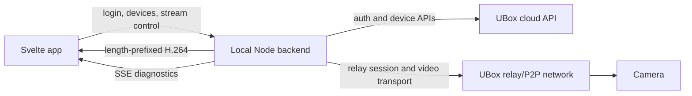

# IMPORTANT

This project was 100% vibecoded. I have not reviewed this code, nor did I code anything that you can see here. I needed a web viewer and asked the AI to do it - and after few days it came up with this. Use at your own risk, I take no responsibility for this project, I will not maintain it, I will not accept pull requests.

# UBox Web

Unofficial local web viewer for UBox-compatible cameras. It logs in to your UBox
account, lists your cameras, starts the live camera session, decodes the H.264
video in the browser, and shows transport diagnostics while the stream is
running.

This project is intended for cameras and accounts you own. It is not affiliated
with UBox, Ubi, Ubia, APKPure, or the Android app vendor.

## Status

Working:

- Account login against the UBox cloud API
- Remembered local login between debug sessions
- Camera/device list
- Live stream startup through the reverse-engineered UBox relay path
- Dual-channel display for devices that expose primary and secondary streams
- Browser-side H.264 decode through WebCodecs
- Live diagnostics for bytes/sec, frames/sec, and stream session events
- Vite HMR development on the same local origin as the backend

Still experimental:

- The live transport is reverse engineered from traffic and native-library
  behavior, so reconnect and loss handling may still need tuning.
- WebCodecs is required for live playback. Use a Chromium-based browser.
- The project is a local viewer, not a packaged desktop app yet.

## Why It Works This Way

The Android app does not expose a simple RTSP or HTTP video URL. Its live view
uses native Android libraries and a proprietary relay/P2P protocol. Loading those
Android `.so` libraries directly in a normal Windows web app is not practical,
and bridging through an emulator would only mirror the app instead of producing a
real reusable viewer.

So this project uses a local Node backend to handle the parts a browser cannot:

- UBox cloud API login and device lookup
- live session setup
- relay/P2P packet handling
- KCP-like stream reassembly
- extraction of length-prefixed Annex B H.264 frames

The browser handles what it is good at:

- account/device/live-stream UI
- WebCodecs H.264 decode
- drawing decoded frames to canvas
- diagnostics charts and event logs

Keeping backend and frontend on the same local origin avoids CORS problems,
keeps auth local, and makes stream endpoints simple:

- `GET /api/status`
- `POST /api/login`
- `GET /api/devices`
- `POST /api/stream/start`
- `GET /api/stream/live.h264?track=primary`
- `GET /api/stream/live.h264?track=secondary`
- `GET /api/stream/events`
- `POST /api/stream/stop`

## Architecture



## Project Layout

```text
server.js                  Local HTTP API, auth, static serving, Vite dev middleware
ubox-live-stream.js        Live relay/P2P session and stream extraction
p4p-codec.js               UBox/P4P packet helpers
h264-mp4.js, live-mp4.js   MP4/H.264 helpers kept for diagnostics and experiments
src/App.svelte             App coordinator and session lifecycle
src/lib/app/               Svelte screen and panel components
src/lib/livePlayback.js    Browser WebCodecs playback controller
src/lib/streamMetrics.js   Diagnostics chart bucketing
src/lib/api.js             Frontend API helpers
```

## Requirements

- Node.js 20 or newer recommended
- npm
- Chromium, Chrome, Edge, or another browser with WebCodecs support
- A UBox account with one or more cameras

## Install

```sh
npm install
```

## Development With HMR

Run one command:

```sh
npm run dev
```

Open:

```text
http://127.0.0.1:48263
```

In dev mode, `server.js` owns port `48263`, serves all `/api/*` and stream
routes, and mounts Vite as middleware for the Svelte app. That gives normal Vite
HMR without moving the frontend to a different origin.

If you prefer the older two-terminal setup:

```sh
npm run backend
npm run dev:vite
```

## Production-Style Local Run

Build the frontend:

```sh
npm run build
```

Start the local backend:

```sh
npm start
```

Open:

```text
http://127.0.0.1:48263
```

## Configuration

Environment variables:

```text
PORT=48263
UBOX_API=https://portal.ubianet.com
UBOX_APP_NAME=UBox
UBOX_APP_VERSION=1.1.363
UBOX_LANG=en
UBOX_REGION=US
UBOX_AUTH_FILE=.ubox-auth.json
```

Login state is stored locally in `.ubox-auth.json` so refreshes and server
restarts do not force a new login. The file contains the account identifier,
hashed password material, and session token. It is ignored by git.

## Diagnostics

The diagnostics panel is intentionally part of the app because the stream is
still being hardened. It shows:

- transferred KB/s per stream
- parsed frames/sec per stream
- recent stream/session events
- relay/session snapshots from the backend

Useful interpretation:

- KB/s moving but frames/video frozen usually means frame parsing or decode is
  stuck.
- KB/s at zero usually means transport/session data stopped arriving.
- frames moving but canvas frozen points at browser decode or draw behavior.

## GitHub Publishing Notes

Before publishing, verify that the repository does not include private or bulky
debug artifacts:

- `.ubox-auth.json`
- `live-dumps/`
- `live-session-logs/`
- `server.out.log`
- `server.err.log`
- packet captures, APKs, XAPKs, decoded private account data

The current `.gitignore` is set up for the normal local artifacts. If you add
new capture or reverse-engineering output folders, add them to `.gitignore`
before committing.

Recommended before first public release:

- add a license file
- add screenshots only if they do not show private cameras or account details
- keep example logs redacted
- mark the project as unofficial

## License

WTFPL. See [LICENSE](LICENSE).

## Legal And Privacy Notes

Use this only with accounts and cameras you own or are authorized to access.
This project stores credentials locally and talks to the same UBox cloud services
used by the official app, but it is not endorsed by nor affiliated with the vendor.
