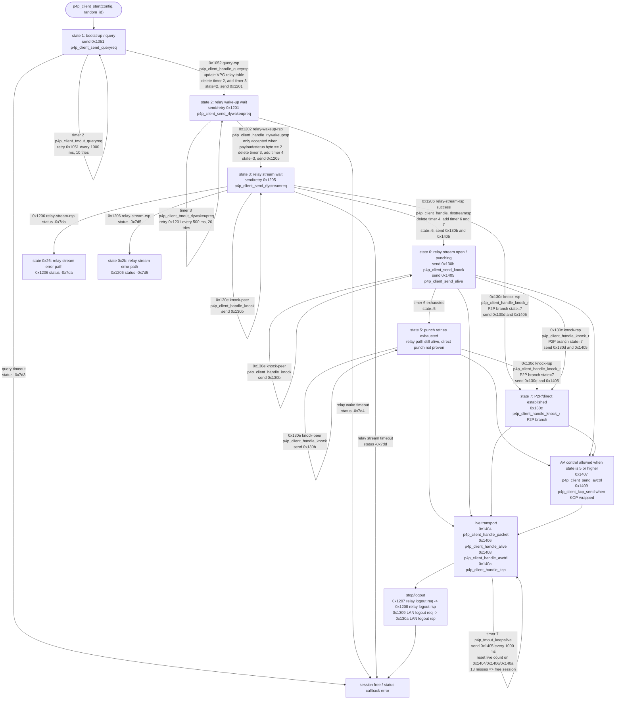
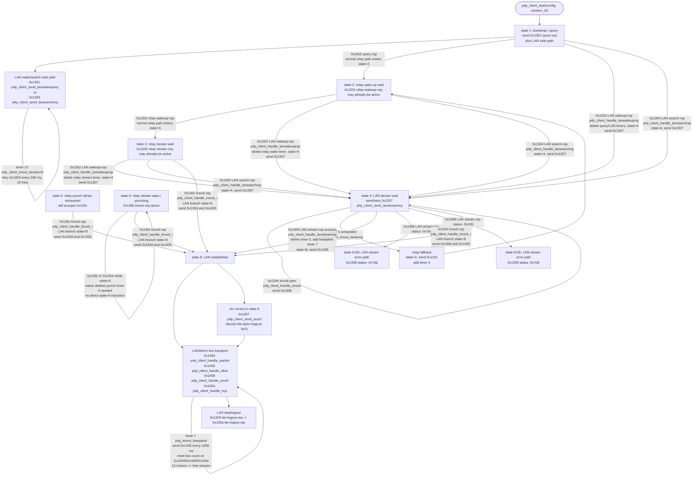
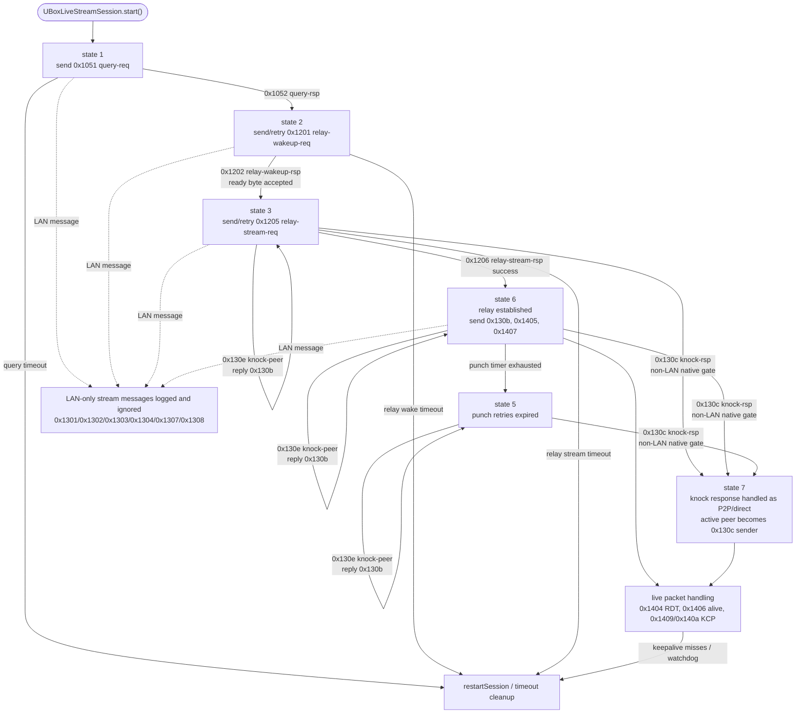

# Native P4P Client State Machine

This document reconstructs the native client state machine from the decompiled
`libUBICAPIs29.so` code. It is intentionally limited to network/session state:
query, wake-up, relay/LAN stream open, punch, keepalive, KCP, and AV control.

Primary native sources:

```text
docs/decompiled/libUBICAPIs29/p4p_client_start.c
docs/decompiled/libUBICAPIs29/p4p_client_receiver.c
docs/decompiled/libUBICAPIs29/p4p_client_handle_queryrsp.c
docs/decompiled/libUBICAPIs29/p4p_client_handle_rlywakeuprsp.c
docs/decompiled/libUBICAPIs29/p4p_client_handle_rlystreamrsp.c
docs/decompiled/libUBICAPIs29/p4p_client_handle_lanwakeuprsp.c
docs/decompiled/libUBICAPIs29/p4p_client_handle_lansearchrsp.c
docs/decompiled/libUBICAPIs29/p4p_client_handle_lanstreamrsp.c
docs/decompiled/libUBICAPIs29/p4p_client_handle_knock_r.c
docs/decompiled/libUBICAPIs29/p4p_client_handle_knock.c
docs/decompiled/libUBICAPIs29/p4p_client_startvideo.c
docs/decompiled/libUBICAPIs29/p4p_client_send_avctrl.c
docs/decompiled/libUBICAPIs29/p4p_client_tmout_*.c
docs/decompiled/libUBICAPIs29/p4p_tmout_keepalive.c
```

The `docs/decompiled/` files are local reverse-engineering artifacts and may be
absent from a public checkout. Regenerate them with the workflow in
`docs/reverse-engineering.md` when deeper verification is needed.

## Native Non-LAN Relay/P2P Graph

This graph shows the relay path and the P2P/direct upgrade path. It excludes
LAN wake/search/stream handling, which is split into the next graph.



## Native LAN Graph

LAN handling runs beside the relay path. `p4p_client_start()` sends either LAN
wake-up `0x1301` or LAN search `0x1303` while the query/relay path is also
running. LAN responses can take states `1`, `2`, or `3` into state `4`, then
`0x1308` can establish state `8`. A LAN branch can also arrive through
`0x130c p4p_client_handle_knock_r`.



## Native State Table

| State | Meaning inferred from native code | Main native functions |
| --- | --- | --- |
| `1` | Bootstrap/query. Sends cloud query plus LAN wake/search side path. | `p4p_client_start`, `p4p_client_send_queryreq`, `p4p_client_send_lanwakeupreq`, `p4p_client_send_lansearchreq`, `p4p_client_tmout_queryreq` |
| `2` | Waiting for relay wake-up readiness. | `p4p_client_handle_queryrsp`, `p4p_client_send_rlywakeupreq`, `p4p_client_tmout_rlywakeupreq` |
| `3` | Waiting for relay stream response. | `p4p_client_handle_rlywakeuprsp`, `p4p_client_send_rlystreamreq`, `p4p_client_tmout_srvlsrreq` |
| `4` | Waiting for LAN stream response. | `p4p_client_handle_lanwakeuprsp`, `p4p_client_handle_lansearchrsp`, `p4p_client_send_lanstreamreq`, `p4p_client_tmout_lanlsrreq` |
| `5` | Punch retry timer expired, but session is not freed. Native still accepts knock messages and AV control. | `p4p_client_tmout_punchreq`, `p4p_client_handle_knock`, `p4p_client_handle_knock_r`, `p4p_client_startvideo` |
| `6` | Relay stream response succeeded; relay path is usable while native attempts punching/direct upgrade. | `p4p_client_handle_rlystreamrsp`, `p4p_client_send_knock`, `p4p_client_send_alive`, `p4p_client_tmout_punchreq` |
| `7` | P2P/direct transport established. | `p4p_client_handle_knock_r`, `p4p_client_send_avctrl`, `p4p_tmout_keepalive` |
| `8` | LAN transport established. | `p4p_client_handle_lanstreamrsp`, `p4p_client_handle_knock_r`, `p4p_client_send_avctrl`, `p4p_tmout_keepalive` |
| `0x26` | Stream response error for native status `-0x7da`. | `p4p_client_handle_rlystreamrsp`, `p4p_client_handle_lanstreamrsp` |
| `0x2b` | Stream response error for native status `-0x7d5`. | `p4p_client_handle_rlystreamrsp`, `p4p_client_handle_lanstreamrsp` |

## Message Map

Native inbound dispatch is in `p4p_client_receiver.c`. The names below are the
native handler names or the project labels derived directly from those handler
names.

| Code | Native/project name | Native role |
| --- | --- | --- |
| `0x1051` | `query-req` / `p4p_client_send_queryreq` | Outbound master/discovery query. Sends to first 3 master servers when `query_kind == 4`, otherwise the full seeded master list. |
| `0x1052` | `query-rsp` / `p4p_client_handle_queryrsp` | Inbound query response; carries VPG relay endpoints and moves state `1 -> 2`. |
| `0x1054` | `syncdb-rsp` / `p4p_client_handle_syncdbrsp` | Inbound sync DB response; not part of live stream startup path. |
| `0x1201` | `relay-wakeup-req` / `p4p_client_send_rlywakeupreq` | Outbound relay wake-up request. |
| `0x1202` | `relay-wakeup-rsp` / `p4p_client_handle_rlywakeuprsp` | Inbound relay wake-up response; accepts only ready byte `2`, then moves `2 -> 3`. |
| `0x1204` | `relay-login-rsp` / `p4p_client_handle_loginrsp` | Inbound relay login response; not used by the current live path. |
| `0x1205` | `relay-stream-req` / `p4p_client_send_rlystreamreq` | Outbound relay stream request; only sent in state `3`. |
| `0x1206` | `relay-stream-rsp` / `p4p_client_handle_rlystreamrsp` | Inbound relay stream response; success moves `3 -> 6`. |
| `0x1207` | `relay-logout-req` | Outbound relay logout. |
| `0x1208` | `relay-logout-rsp` / `p4p_client_handle_logoutrsp` | Inbound relay logout response. |
| `0x1209` | `relay-close-req` / `p4p_client_handle_rlyclosereq` | Inbound relay close request. |
| `0x120e` | `relay-rtd-update` | Inbound relay timing/RTD update path. |
| `0x1301` | `lan-wakeup-req` / `p4p_client_send_lanwakeupreq` | Outbound LAN wake-up request. |
| `0x1302` | `lan-wakeup-rsp` / `p4p_client_handle_lanwakeuprsp` | Inbound LAN wake-up response; can move early states to `4`. |
| `0x1303` | `lan-search-req` / `p4p_client_send_lansearchreq` | Outbound LAN search request. |
| `0x1304` | `lan-search-rsp` / `p4p_client_handle_lansearchrsp` | Inbound LAN search response; can move early states to `4`. |
| `0x1306` | `lan-login-rsp` / `p4p_client_handle_loginrsp` | Inbound LAN login response; not used by the current live path. |
| `0x1307` | `lan-stream-req` / `p4p_client_send_lanstreamreq` | Outbound LAN stream request; only sent in state `4`. |
| `0x1308` | `lan-stream-rsp` / `p4p_client_handle_lanstreamrsp` | Inbound LAN stream response; success moves `4 -> 8`. |
| `0x1309` | `lan-logout-req` | Outbound LAN logout. |
| `0x130a` | `lan-logout-rsp` / `p4p_client_handle_logoutrsp` | Inbound LAN logout response. |
| `0x130b` | `knock-req` / `p4p_client_send_knock` | Outbound punch/knock request. |
| `0x130c` | `knock-rsp` / `p4p_client_handle_knock_r` | Inbound punch/knock response; moves to state `7` or `8`. |
| `0x130d` | `knock-ack` | Outbound knock acknowledgement sent by `p4p_client_handle_knock_r`. |
| `0x130e` | `knock-peer` / `p4p_client_handle_knock` | Inbound peer knock; native replies with `0x130b`. |
| `0x1402` | `ioctrl-rsp` / `p4p_client_handle_ioctrl` | Inbound IO control response. |
| `0x1404` | `rdt-video` / `p4p_client_handle_packet` | Inbound direct/RDT packet; resets live count. |
| `0x1405` | `alive-req` / `p4p_client_send_alive` | Outbound keepalive. |
| `0x1406` | `alive-rsp` / `p4p_client_handle_alive` | Inbound keepalive response; resets live count. |
| `0x1407` | `avctrl-req` / `p4p_client_send_avctrl` | Outbound AV control, including start video. |
| `0x1408` | `avctrl-rsp` / `p4p_client_handle_avctrl` | Inbound AV control response. |
| `0x1409` | `kcp-client` / `p4p_client_kcp_send` | Outbound client KCP packet. |
| `0x140a` | `kcp-device` / `p4p_client_handle_kcp` | Inbound device KCP packet; resets live count. |

## Native AV-Control Gate

`p4p_client_startvideo()` and `p4p_client_send_avctrl()` both reject sessions
whose state is below `5`.

Native AV-control addressing changes by state:

```text
state 7 or state 8 -> msgLen 0x21, direct/LAN-style SID fields
state 5 or state 6 -> msgLen 0x24, relay-style SID fields
```

So native start-video is legal after relay stream success (`state 6`) and after
direct/LAN promotion (`state 7` or `8`). It is not legal during query, wake-up,
relay stream request, or LAN stream request states (`1` through `4`).

## Current UBox Web State Machine

Current implementation lives mostly in `ubox-live-stream.js`.



## Native vs Current Comparison

| Area | Native behavior | Current UBox Web behavior | Match |
| --- | --- | --- | --- |
| Initial state | `p4p_client_start()` sets state `1`. | Constructor sets `sessionState.state = 1`. | Yes |
| Query request | Sends `0x1051` to native master/discovery servers and retries timer type `2` every 1000 ms, 10 tries. Fanout is 3 servers when `query_kind == 4`, otherwise the full seeded list. | Sends `0x1051` to the same seeded master/discovery list with the same `query_kind == 4` fanout. | Yes |
| LAN startup side path | Also sends `0x1301` LAN wake-up or `0x1303` LAN search, with timers `1` or `12`. | Not implemented; LAN stream messages are logged and ignored. | Intentionally no |
| Query response | `0x1052` updates native VPG/local tables, deletes query timer, adds relay wake timer, sets state `2`, sends `0x1201` to discovered VPG relay endpoints. | Parses the VPG item at payload offset `0x1c`, extracts up to four IPv4 relay targets, stores IPv6 metadata for diagnostics, sets state `2`, starts relay wake timer, sends `0x1201` to the discovered IPv4 targets. | Mostly |
| Relay wake response | `0x1202` accepted only in state `2` and only when native ready byte is `2`; then state `3`, timer `4`, send `0x1205`. | Same state gate and ready-byte gate when `requireWakeupReadyStatus` is enabled; then state `3`, send/retry `0x1205`. | Mostly |
| Relay stream request | Native sends `0x1205` only in state `3`, retries every 1000 ms, 16 tries. | Same state and retry shape. Payload may still differ in fields not fully reconstructed. | Partial |
| Relay stream response | `0x1206` success sets state `6`, starts punch timer `6`, keepalive timer `7`, sends `0x130b` and `0x1405`. | `0x1206` success sets state `6`, starts punch retries, sends `0x130b` and `0x1405`. | Yes |
| Start-video timing | Native allows `p4p_client_startvideo()` only when state `>= 5`. Java/native caller decides when to call it. | Sends `0x1407` automatically right after `0x1206` moves to state `6`, and again when KCP appears. | Legal by native gate, but timing differs |
| Punch retries | Native retries `0x130b` in state `6` for 6 ticks, then demotes to state `5`. | Same state `6 -> 5` retry model. | Yes |
| Knock response | Native accepts `0x130c` in states `3`, `4`, `5`, `6`; branch decides state `7` P2P or state `8` LAN, sends `0x130d` and `0x1405`. | Accepts `0x130c` only in non-LAN states `3`, `5`, `6`; switches active peer to the packet sender, sends `0x130d` and `0x1405`; always promotes to state `7`. | Partial |
| Peer knock | Native handles `0x130e` in states `3`, `4`, `5`, `6` and replies with `0x130b`. | Handles `0x130e` in non-LAN states `3`, `5`, `6` and replies with `0x130b`. | Partial |
| LAN stream | Native can move `1/2/3 -> 4` on `0x1302` or `0x1304`, send `0x1307`, then `0x1308` success moves to `8`. In state `6`, those LAN responses only cancel punch timer; LAN promotion from `6` happens through the `0x130c` LAN branch. | Not implemented; `0x1301`, `0x1302`, `0x1303`, `0x1304`, `0x1307`, and `0x1308` are logged as ignored. | Intentionally no |
| Live count | Native resets live count on `0x1404`, `0x1406`, and `0x140a`; keepalive frees session after 13 misses. | Resets on `0x1404`, `0x1406`, `0x1409`, `0x140a`; restarts after configured miss limit, default 13. | Mostly |
| KCP direction | Native sends client KCP as `0x1409`, receives device KCP as `0x140a`. | Sends KCP as `0x1409`; accepts both `0x1409` and `0x140a` inbound. | Superset |
| AV-control addressing | Native uses relay-style fields in states `5/6`, direct/LAN-style fields in states `7/8`. | Same `state === 7 || state === 8` branch exists, but state `8` is never reached. | Partial |
| Stop/logout | Native sends relay logout `0x1207` or LAN logout `0x1309`, receives `0x1208`/`0x130a`. | Sends relay or LAN logout based on state, but practical path is relay/P2P because state `8` is absent. | Partial |

## Main Differences To Investigate Later

The highest-signal remaining gaps are:

1. Native LAN path is missing: `0x1301`, `0x1302`, `0x1303`, `0x1304`, `0x1307`,
   `0x1308`, and state `4/8`.
2. Native `0x1052` stores full VPG/local routing tables, including IPv6 relay
   slots. Current code extracts the native IPv4 relay slots used by the
   non-IPv6 path and logs IPv6 metadata, but does not dial IPv6 relays or keep
   the full native VPG cache/refcount model.
3. Native `0x130c` can promote to state `8` when it identifies a LAN path;
   current code always promotes to state `7`.
4. Native accepts `0x130e` in state `4`; current code intentionally limits it
   to non-LAN states `3`, `5`, and `6`.
5. Native start-video is caller-driven after state `>= 5`; current code sends it
   automatically as soon as relay stream response succeeds.
